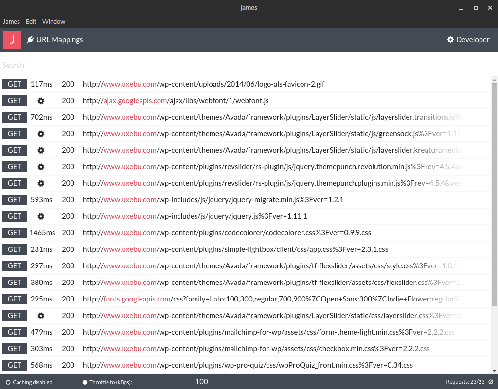

# James

James is an HTTP Proxy and Monitor that enables developers to view and intercept requests made from the browser.
It is an open-source alternative to the popular developer tool [Charles](http://www.charlesproxy.com/)

James is build with [hoxy](https://github.com/greim/hoxy), [electron](https://github.com/atom/electron) and [react](https://facebook.github.io/react/index.html)

## Installing
Download the correct version for your OS and run

## Running in a development environment

 1. Clone the repository
 2. `npm install`
 3. `npm run watch`
 4. `npm start`
 5. From within the developer tools, refresh the app
 
## HTTPs Support

To enable HTTPs support follow the [instructions in our wiki](https://github.com/uxebu/james/wiki/Configuring-James-for-HTTPS)

## Other useful NPM Commands

- `npm run build`: Completely builds the app
- `npm run watch`: Watches JS, SASS and resource files, transpiling/copying them automatically. Lints sources on-change
- `npm run lint`: Checks all JS code against defined code styling rules
- `npm run test`: Runs all tests
- `npm run package`: Creates a standalone app bundle for all operating systems

## Contributing

Feel free to open pull requests and issues!
If you need inspiration, take a look in the issue section.

### Guidelines
- Make sure that no tests are failing
- Always add tests for new features
- Make sure that there are no linting errors in your code (use `npm run lint`)

### Contributors
- @davidneat
- @klipstein
- @mitchhentges
- @nerdbeere

## License
The MIT License (MIT)

Copyright (c) 2015 Julian Hollmann

Permission is hereby granted, free of charge, to any person obtaining a copy of this software and associated documentation files (the "Software"), to deal in the Software without restriction, including without limitation the rights to use, copy, modify, merge, publish, distribute, sublicense, and/or sell copies of the Software, and to permit persons to whom the Software is furnished to do so, subject to the following conditions:

The above copyright notice and this permission notice shall be included in all copies or substantial portions of the Software.

THE SOFTWARE IS PROVIDED "AS IS", WITHOUT WARRANTY OF ANY KIND, EXPRESS OR IMPLIED, INCLUDING BUT NOT LIMITED TO THE WARRANTIES OF MERCHANTABILITY, FITNESS FOR A PARTICULAR PURPOSE AND NONINFRINGEMENT. IN NO EVENT SHALL THE AUTHORS OR COPYRIGHT HOLDERS BE LIABLE FOR ANY CLAIM, DAMAGES OR OTHER LIABILITY, WHETHER IN AN ACTION OF CONTRACT, TORT OR OTHERWISE, ARISING FROM, OUT OF OR IN CONNECTION WITH THE SOFTWARE OR THE USE OR OTHER DEALINGS IN THE SOFTWARE.
